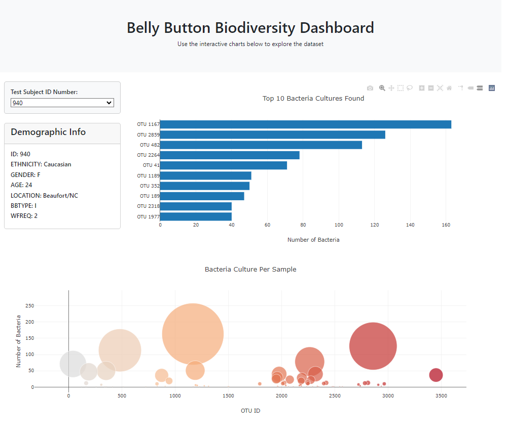

Belly Button Biodiversity Dashboard

**(1) Project Overview and Purpose:**

The purpose of this exercise is to build an interactive dashboard to explore the Belly Button Biodiversity dataset, which catalogs the microbes that colonize human navels.

**(2) Dataset Description:**

The biodiversity project is run by a laboratory at North Carolina State University. More information is available at this website, https://robdunnlab.com/projects/belly-button-biodiversity/.

The dataset reveals that a small handful of microbial species (also called operational taxonomic units, or OTUs, in the study) were present in more than 70% of people, while the rest were relatively rare.

The dataset is available in a .json format here: https://static.bc-edx.com/data/dl-1-2/m14/lms/starter/samples.json .

**(3) Data Cleaning and Preprocessing:**

No data cleaning was performed on the data retrieved in the .json file.

Function were built to:

(a) filter metadata, then append new tags for each key-value in the filtered metadata;

(b) build charts for the dashboard; and

(c) run upon page load

**(4) Data Visualization Techniques:**

Demographic information is presented in a small table, with two types of charts (one bar chart and one bubble chart).

**(5) Results and Analysis:**

The below figure is the resulting dashboard:

The user can select a Test Subject ID Number, which then lists the Test Subject's demographic information within the table; their Top 10 Bacteria Cultures Found in a bar chart; and a bubble chart displaying the number of bacteria found per type of bacteria.

**(6) Ethical Considerations:**

This dataset should be considered sensitive. While patient names are not used, there may be sufficient information (i.e., date of birth; gender; location; etc.) that could lead to identification. Constraints on access should be predicated upon directives within the Health Insurance Portability and Accountability Act (HIPAA) Privacy Rule.

**(7) Instructions for Interacting with the Project:**

The Javascript code is located in the **static/js** folder as a file titled "app_final_roop.js".

The Index file is located in the main folder as a file titled "index.html".

The dataset is located as a .json file in the main folder as a file titled "samples.json".

A picture of the website as a .png file is located in the main folder as a file titled "bellybutton_biodiversity_dashboard_roop.png".

Additional files are stored in the **bellybutton_biodiversity_dashboard_roop_files** folder.

**(8) Citations:**

(a) Delac, M. [JavaScript] - How to Get a Single Element of a JSON Object in JavaScript. (2023). Retrieved from https://www.shecodes.io/athena/18344-how-to-get-a-single-element-of-a-json-object-in-javascript

(b) Hover Text and Formatting in JavaScript. (2024). Retrieved from https://plotly.com/javascript/hover-text-and-formatting/

(c) Horizontal Bar Charts in JavaScript. (2024). Retrieved from https://plotly.com/javascript/horizontal-bar-charts/

(d) Al Imran, A. How To Convert Json String To Map In Javascript. (2024, March 27). Retrieved from https://rswpthemes.com/how-to-convert-json-string-to-map-in-javascript/

(e) Questions during office hours with instructor on 10-Jul-2024

(f) Xpert Learning Associate - questions regarding:

     (i) Code syntax questions

     (ii) JSON questions

